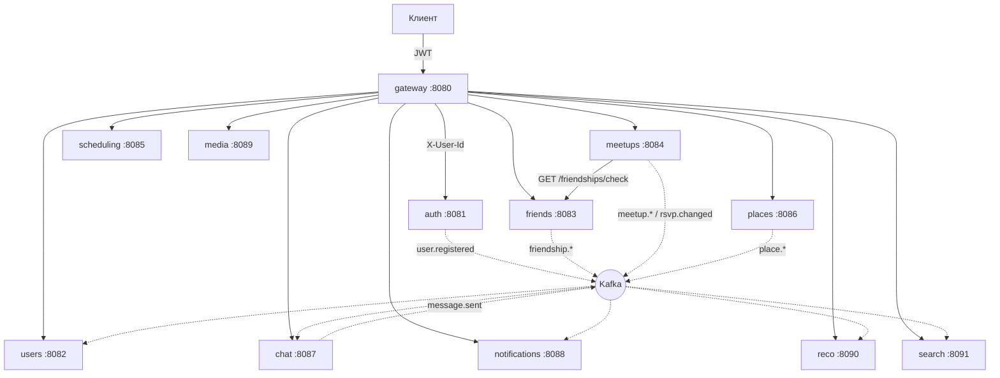
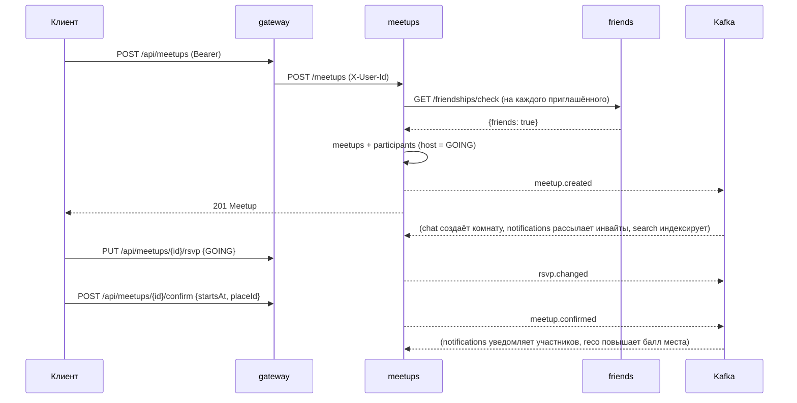

# Мастер-спецификация meetup-platform

Единый контракт платформы «встречи друзей»: границы сервисов, HTTP API, доменные
события, инварианты и известные ограничения. Документ описывает **фактическое**
состояние кода и является источником истины при изменениях.

Правила разработки, вытекающие из этой спецификации, лежат в `.cursor/rules/`.
Любое изменение публичного API, схемы события, порта или владения данными
фиксируется здесь в том же коммите.

- Версия платформы: `0.1.0` (`build.gradle.kts`)
- Стек: Kotlin 2.0.21 / JDK 21, Spring Boot 3.3.5, Spring Cloud Gateway 2023.0.3,
  PostgreSQL 16, Kafka 3.8 (KRaft)

---

## 1. Назначение и границы

Платформа помогает группе друзей договориться о встрече и провести её:
найти друг друга, предложить время, выбрать место, обсудить в чате, подтвердить
и поделиться фотографиями.

**В границах системы:** аутентификация, профили, граф дружбы, агрегат «встреча»
с приглашениями и RSVP, опросы по времени, каталог мест с geo-поиском, групповой
чат, in-app уведомления, медиа-альбомы встреч, рекомендации мест, поиск.

**Вне границ:** публичные (открытые всем) события, платежи и билеты, модерация
контента, push/email-доставка, мобильные клиенты, presence («онлайн/офлайн»).

Ключевые доменные ограничения:

- Приглашать на встречу можно **только подтверждённых друзей**.
- Только организатор (`hostId`) приглашает, подтверждает и отменяет встречу.
- Профиль редактирует только его владелец.
- Отменённая встреча иммутабельна.

---

## 2. Структура репозитория

```
buildSrc/                       convention-плагины meetup-kotlin, meetup-service
common/                         контракты доменных событий (без Spring и JPA)
services/<домен>-service/       по одному Gradle-модулю на сервис
  src/main/kotlin/com/meetup/<домен>/
    <Домен>Application.kt       @SpringBootApplication + fun main + бины клиентов
    <Агрегат>.kt                @Entity + JpaRepository
    <Агрегат>Controller.kt      DTO (data class) + @RestController
    <Агрегат>Service.kt         доменная логика, если её больше одной проверки
    <Х>EventsListener.kt        @KafkaListener-подписчики
  src/main/resources/application.yml
infra/postgres/init.sql         CREATE DATABASE для каждого сервиса
docker-compose.yml              PostgreSQL + Kafka для локального стенда
```

Внутри сервиса файлы лежат плоско в одном пакете: слои `web/`, `domain/`, `repo/`
не заводим — сервисы малы, а границы контекста проходят между модулями, не внутри них.

---

## 3. Архитектурный обзор



Три уровня интеграции:

1. **Синхронно через gateway** — весь клиентский трафик; gateway валидирует JWT
   и проставляет доверенный `X-User-Id`.
2. **Синхронно между сервисами** — только там, где решение нельзя принять без
   ответа. Единственный случай: `meetups-service` → `friends-service` (ACL инвайта).
3. **Асинхронно через Kafka** — все побочные эффекты: профили, чат-комнаты,
   уведомления, поисковый индекс, рекомендации.

---

## 4. Сквозные соглашения

### 4.1 Идентичность и модель доверия

- `auth-service` выпускает JWT HS256 с `sub = userId` и claim `type` (`access` | `refresh`).
  TTL: access 30 минут, refresh 14 дней. Секрет симметричный, общий с gateway (`JWT_SECRET`).
- `JwtAuthGlobalFilter` (order `-100`, до маршрутизации): пропускает без токена
  только `/api/auth/**`, для остальных требует `Authorization: Bearer <access>`.
  Клиентский `X-User-Id` вырезается **всегда**, включая публичные пути.
- Сервисы за gateway безусловно доверяют `X-User-Id`. В продакшене это требует
  mTLS или network policy, запрещающей обращения к сервисам напрямую.
- Авторизация (кто владелец объекта) выполняется в сервисе, а не в gateway.

### 4.2 Маршрутизация

Публичный путь `/api/<ресурс>/**` → маршрут gateway → `StripPrefix=1` → внутренний
`/<ресурс>/**`. Контроллеры объявляют путь без `/api`.

| Публичный путь | Сервис | Переменная адреса |
|---|---|---|
| `/api/auth/**` | auth :8081 | `AUTH_URL` |
| `/api/users/**` | users :8082 | `USERS_URL` |
| `/api/friendships/**` | friends :8083 | `FRIENDS_URL` |
| `/api/meetups/**` | meetups :8084 | `MEETUPS_URL` |
| `/api/polls/**` | scheduling :8085 | `SCHEDULING_URL` |
| `/api/places/**` | places :8086 | `PLACES_URL` |
| `/api/chat/**` | chat :8087 | `CHAT_URL` |
| `/ws/**` | chat :8087 (без StripPrefix) | `CHAT_WS_URL` |
| `/api/notifications/**` | notifications :8088 | `NOTIFICATIONS_URL` |
| `/api/media/**` | media :8089 | `MEDIA_URL` |
| `/api/recommendations/**` | reco :8090 | `RECO_URL` |
| `/api/search/**` | search :8091 | `SEARCH_URL` |

### 4.3 Ошибки

Ответы об ошибке — стандартный формат Spring Boot (`timestamp`, `status`, `error`,
`message`, `path`); генерируются через `ResponseStatusException`. Семантика кодов
одинакова во всех сервисах:

| Код | Значение |
|---|---|
| 400 | невалидный ввод или нарушенная предпосылка (`Poll needs at least one option`) |
| 401 | нет/невалиден/не тот тип токена — выдаёт только gateway |
| 403 | вызывающий не владелец, не host, не друг, не приглашён |
| 404 | сущность не найдена |
| 409 | конфликт состояния: дубликат, встреча отменена, опрос закрыт |
| 410 | метаданные есть, содержимое утрачено (media) |

### 4.4 Идентификаторы, время, данные

- Все идентификаторы — `UUID v4`, генерируются приложением. `userId` единый для
  всей платформы, назначается в `auth-service` при регистрации.
- Все моменты времени — `Instant` в UTC, в JSON — ISO-8601 (`2026-08-01T18:00:00Z`).
  Перевод в локальный пояс — задача клиента (`UserProfile.timezone`, IANA).
- Enum'ы передаются строками и хранятся строками (`@Enumerated(STRING)`).
- Пагинация не унифицирована: списки отдаются целиком, где объём ограничен
  доменом (участники, избранное), и через `limit` с обрезкой `coerceIn`, где нет
  (чат 1–200, поиск 1–100, рекомендации 1–50).

### 4.5 Конфигурация

Единственный источник конфигурации — `application.yml` с подстановкой окружения
`${VAR:дефолт}`; дефолты рассчитаны на локальный стенд.

| Переменная | Назначение | Дефолт |
|---|---|---|
| `POSTGRES_HOST` | хост PostgreSQL | `localhost` |
| `KAFKA_BOOTSTRAP` | брокеры Kafka | `localhost:9092` |
| `JWT_SECRET` | секрет подписи (≥32 байт), gateway + auth | dev-значение |
| `FRIENDS_BASE_URL` | адрес friends для ACL из meetups | `http://localhost:8083` |
| `MEDIA_STORAGE_DIR` | каталог файлов media | `var/media-uploads` |
| `*_URL` | адреса сервисов для маршрутов gateway | `localhost:808x` |

БД: одна на сервис, имя `<домен>_db`, пользователь/пароль `meetup`/`meetup`
(dev), создание — `infra/postgres/init.sql`. Схема поднимается `ddl-auto: update`.

### 4.6 Наблюдаемость

Actuator включён во всех сервисах (`spring-boot-starter-actuator`): доступен
`/actuator/health` на порту сервиса, не проксируется через gateway. Логирование —
SLF4J, сообщения на английском. Трассировка, метрики бизнес-событий и
корреляционный id не настроены (см. §10).

---

## 5. Каталог сервисов

### 5.1 gateway — 8080

Единая точка входа. Без БД и без состояния.

- Маршруты — таблица §4.2, все с `StripPrefix=1`, кроме `/ws/**`.
- `JwtAuthGlobalFilter`: проверка подписи и срока, требование `type=access`,
  подстановка `X-User-Id`, 401 при любой проблеме.
- Публичные префиксы: `/api/auth/`.

### 5.2 auth-service — 8081, `auth_db`

Владеет: `credentials` (email, BCrypt-хэш пароля, displayName). Единственное
место в системе, где есть пароль.

| Метод | Путь | Тело | Ответ | Ошибки |
|---|---|---|---|---|
| POST | `/api/auth/register` | `{email, password(8..128), displayName}` | 201 `{userId, accessToken, refreshToken}` | 400 валидация, 409 email занят |
| POST | `/api/auth/login` | `{email, password}` | 200 токены | 401 |
| POST | `/api/auth/refresh` | `{refreshToken}` | 200 новая пара | 401 |

Публикует: `user.registered`. Подписок нет.

Инварианты: email уникален; ответ на неверный логин и на несуществующего
пользователя идентичен (401 `Invalid credentials`); refresh-токен нельзя
использовать как access (проверка claim `type`).

### 5.3 users-service — 8082, `users_db`

Владеет: `user_profiles` (displayName, bio, avatarUrl, timezone, visibility).
Профиль создаётся **только** подписчиком события, не через HTTP.

| Метод | Путь | Ответ | Ошибки |
|---|---|---|---|
| GET | `/api/users/{id}` | `UserProfile` | 404 |
| GET | `/api/users?ids=<uuid>,<uuid>` | `[UserProfile]` | — |
| PUT | `/api/users/{id}` | `UserProfile` | 403 чужой профиль, 404 |

Подписан: `user.registered` → создаёт профиль, идемпотентно (`existsById`).

Инварианты: `id` профиля = `userId` из auth; редактирование только своего
профиля (`{id}` == `X-User-Id`); частичное обновление — `null`-поля не меняются.
`visibility` (`PUBLIC` / `FRIENDS_ONLY` / `PRIVATE`) хранится, но **пока не
применяется** при чтении.

### 5.4 friends-service — 8083, `friends_db`

Владеет: `friendships` — направленное ребро `(requesterId → addresseeId)` со
статусом `PENDING` / `ACCEPTED` / `DECLINED` / `BLOCKED`; пара уникальна.
Принятая дружба считается симметричной.

| Метод | Путь | Тело | Ответ | Ошибки |
|---|---|---|---|---|
| POST | `/api/friendships` | `{addresseeId}` | 201 `Friendship` | 400 сам себе, 403 блокировка, 409 уже есть/ожидает |
| POST | `/api/friendships/{id}/accept` | — | 200 | 403 не адресат, 404, 409 уже обработана |
| POST | `/api/friendships/{id}/decline` | — | 200 | те же |
| POST | `/api/friendships/block` | `{userId}` | 200 | — |
| GET | `/api/friendships/friends` | — | `[UUID]` | — |
| GET | `/api/friendships/pending` | — | `[Friendship]` | — |
| GET | `/api/friendships/check?userA&userB` | — | `{friends: Boolean}` | — |

Публикует: `friendship.requested`, `friendship.accepted`.

`GET /friendships/check` — внутренний ACL-эндпоинт для `meetups-service`
(проксируется gateway'ем, отдельной защиты нет). Блокировка удаляет все связи
пары и создаёт запись `BLOCKED`; обратной операции (разблокировки) нет.

### 5.5 meetups-service — 8084, `meetups_db`

Ядро домена. Владеет: `meetups` (host, title, description, status, startsAt,
placeId) и `participants` (meetupId, userId, rsvp, respondedAt; пара уникальна).

Жизненный цикл: `PLANNED` → `CONFIRMED` → `CANCELLED` (отмена возможна из любого
активного состояния, из `CANCELLED` переходов нет).
RSVP: `INVITED` → `GOING` / `MAYBE` / `DECLINED`.

| Метод | Путь | Тело | Ответ | Ошибки |
|---|---|---|---|---|
| POST | `/api/meetups` | `{title, description?, invitedUserIds[]}` | 201 `Meetup` | 403 не друг |
| POST | `/api/meetups/{id}/invite` | `{userId}` | 200 `Participant` | 403 не host / не друг, 404, 409 уже приглашён |
| PUT | `/api/meetups/{id}/rsvp` | `{status}` | 200 `Participant` | 403 не приглашён, 404, 409 отменена |
| POST | `/api/meetups/{id}/confirm` | `{startsAt, placeId?}` | 200 `Meetup` | 403 не host, 404, 409 отменена |
| POST | `/api/meetups/{id}/cancel` | — | 200 `Meetup` | 403 не host, 404, 409 уже отменена |
| GET | `/api/meetups/feed` | — | `[Meetup]` | — |
| GET | `/api/meetups/{id}` | — | `Meetup` | 404 |
| GET | `/api/meetups/{id}/participants` | — | `[Participant]` | 404 |

Публикует: `meetup.created`, `meetup.confirmed`, `meetup.cancelled`, `rsvp.changed`.
Вызывает: `GET /friendships/check` перед каждым приглашением.

Инварианты: организатор при создании получает `GOING`; сам себя пригласить нельзя
(фильтруется); приглашать можно только друзей организатора; `participantIds` в
событиях `confirmed`/`cancelled` не включает отклонивших (`DECLINED`);
лента (`feed`) — неотменённые встречи, где пользователь host или участник,
сортировка по `startsAt` (`nulls last`).

### 5.6 scheduling-service — 8085, `scheduling_db`

Владеет: `polls` (meetupId, createdBy, status, selectedOptionId), `poll_options`
(слоты), `poll_votes` (пара «слот + пользователь» уникальна).

| Метод | Путь | Тело | Ответ | Ошибки |
|---|---|---|---|---|
| POST | `/api/polls` | `{meetupId, options:[{startsAt, endsAt?}]}` | 201 `PollResults` | 400 пустой список |
| POST | `/api/polls/{pollId}/options/{optionId}/votes` | — | 200 `PollResults` | 400 чужой слот, 404, 409 закрыт |
| DELETE | `/api/polls/{pollId}/options/{optionId}/votes` | — | 200 `PollResults` | 404, 409 закрыт |
| POST | `/api/polls/{pollId}/close` | — | 200 `PollResults` | 403 не автор, 404, 409 закрыт/нет слотов |
| GET | `/api/polls/{pollId}` | — | `PollResults` | 404 |
| GET | `/api/polls?meetupId=` | — | `[PollResults]` | — |

Событий не публикует и не потребляет.

Инварианты: голос идемпотентен; закрыть опрос может только автор; при закрытии
фиксируется слот с максимумом голосов; `PollResults.options` отсортированы по
убыванию голосов. Существование встречи и участие в ней **не проверяются**,
победивший слот в `meetups.confirm` автоматически не переносится.

### 5.7 places-service — 8086, `places_db`

Владеет: `places` (name, category, address, lat/lon, createdBy),
`place_favorites` (пара «место + пользователь» уникальна).

| Метод | Путь | Тело | Ответ | Ошибки |
|---|---|---|---|---|
| POST | `/api/places` | `{name, category?, address?, latitude, longitude}` | 201 `Place` | — |
| GET | `/api/places/{id}` | — | `Place` | 404 |
| GET | `/api/places/nearby?lat&lon&radiusKm=5.0` | — | `[{place, distanceKm}]` | — |
| POST | `/api/places/{id}/favorite` | — | 200 `PlaceFavorite` | 404, 409 уже в избранном |
| GET | `/api/places/favorites` | — | `[Place]` | — |

Публикует: `place.created`, `place.favorited`.

Geo-поиск — полный проход по каталогу с формулой haversine, сортировка по
удалённости. Приемлемо для демо-объёмов; целевая реализация — PostGIS-индекс.

### 5.8 chat-service — 8087, `chat_db`

Владеет: `chat_rooms` (уникальный `meetupId`, nullable для личных чатов),
`chat_messages` (roomId, senderId, text ≤ 4000, sentAt).

| Транспорт | Путь | Ответ | Ошибки |
|---|---|---|---|
| GET | `/api/chat/rooms/by-meetup/{meetupId}` | `ChatRoom` | 404 комната ещё не создана |
| POST | `/api/chat/rooms/{roomId}/messages` `{text}` | `ChatMessage` | 404 |
| GET | `/api/chat/rooms/{roomId}/messages?limit=50` | `[ChatMessage]`, новые первыми, limit 1–200 | — |
| STOMP | подключение `/ws`, отправка `/app/rooms/{roomId}`, подписка `/topic/rooms/{roomId}` | — | — |

Подписан: `meetup.created` → создаёт комнату, идемпотентно (`findByMeetupId`).
Публикует: `message.sent` (с `preview` — первые 80 символов).

Брокер — встроенный simple broker: рассылка работает в пределах одного инстанса,
горизонтальное масштабирование требует внешнего relay. Комната появляется
асинхронно, поэтому сразу после создания встречи `by-meetup` может вернуть 404.
Членство в комнате не проверяется (см. §10).

### 5.9 notifications-service — 8088, `notifications_db`

Владеет: `notifications` (userId, type, title, body, refId, read, createdAt).
Чистая проекция событий — собственного write-API у уведомлений нет.

| Метод | Путь | Ответ | Ошибки |
|---|---|---|---|
| GET | `/api/notifications` | `[Notification]`, новые первыми | — |
| POST | `/api/notifications/{id}/read` | `Notification` | 403 чужое, 404 |
| POST | `/api/notifications/read-all` | количество помеченных (`Int`) | — |

Подписан на 7 топиков; соответствие событий и типов уведомлений:

| Событие | Адресат | `type` | `refId` |
|---|---|---|---|
| `user.registered` | новый пользователь | `welcome` | — |
| `friendship.requested` | адресат заявки | `friend_request` | friendshipId |
| `friendship.accepted` | автор заявки | `friend_accepted` | friendshipId |
| `meetup.created` | приглашённые | `meetup_invite` | meetupId |
| `meetup.confirmed` | участники | `meetup_confirmed` | meetupId |
| `meetup.cancelled` | участники, кроме host | `meetup_cancelled` | meetupId |
| `rsvp.changed` | host (кроме своего ответа) | `rsvp_changed` | meetupId |

`message.sent` уведомлений не создаёт: без presence-сервиса неизвестно, кто из
участников офлайн. `type` — машиночитаемый ключ для маршрутизации в UI, `refId` —
для deep-link. Push и email подключаются здесь же как дополнительные каналы.

### 5.10 media-service — 8089, `media_db`

Владеет: `media_assets` (meetupId, uploadedBy, fileName, contentType, sizeBytes,
storageKey). Байты — на локальном диске (`MEDIA_STORAGE_DIR`), ключ `<meetupId>/<assetId>`.

| Метод | Путь | Ответ | Ошибки |
|---|---|---|---|
| POST | `/api/media/meetups/{meetupId}` (multipart, поле `file`) | 201 `MediaAsset` | 400 пустой файл |
| GET | `/api/media/meetups/{meetupId}` | `[MediaAsset]`, новые первыми | — |
| GET | `/api/media/{assetId}/content` | содержимое с `Content-Type` | 404 метаданных, 410 файл утрачен |

Лимит запроса — 25 MB. Событий не публикует и не потребляет. Целевая реализация —
S3 с presigned-ссылками, чтобы байты не шли через JVM.

### 5.11 recommendations-service — 8090, без БД

Скоринг мест в памяти (`ConcurrentHashMap`), восстанавливается перечитыванием
топиков (`auto-offset-reset: earliest`).

| Метод | Путь | Ответ |
|---|---|---|
| GET | `/api/recommendations/places?limit=10` | `[{placeId, score}]`, limit 1–50 |

Подписан: `place.favorited` (вес 3 — сильный сигнал), `meetup.confirmed`
(вес 1 каждому участнику, если задано место).
Формула: `score = персональный × 2 + глобальный`. Персональный сигнал доминирует,
глобальная популярность заполняет пробелы и разрешает ничьи.

### 5.12 search-service — 8091, без БД

In-memory индекс с линейным сканом, восстанавливается из Kafka.

| Метод | Путь | Ответ |
|---|---|---|
| GET | `/api/search?q=&type=&limit=20` | `[{id, type, title, text}]`, limit 1–100 |

`type`: `USER` | `MEETUP` | `PLACE` (не задан — искать по всем).
Подписан: `user.registered` (имя + email), `meetup.created` (название),
`place.created` (название + категория). Совпадение — все слова запроса содержатся
в тексте документа, без учёта регистра. Приватность профилей и участие во встрече
при выдаче **не учитываются** (см. §10).

---

## 6. Каталог доменных событий

Все контракты — `common/src/main/kotlin/com/meetup/common/events/`. Ключ
сообщения — id агрегата (события одной сущности упорядочены). Каждое событие
несёт `occurredAt: Instant`.

| Топик | Payload (кроме `occurredAt`) | Продюсер | Подписчики |
|---|---|---|---|
| `user.registered` | `userId, email, displayName` | auth | users, notifications, search |
| `friendship.requested` | `friendshipId, requesterId, addresseeId` | friends | notifications |
| `friendship.accepted` | `friendshipId, requesterId, addresseeId` | friends | notifications |
| `meetup.created` | `meetupId, hostId, title, invitedUserIds` | meetups | chat, notifications, search |
| `meetup.confirmed` | `meetupId, hostId, title, startsAt, placeId?, participantIds` | meetups | notifications, recommendations |
| `meetup.cancelled` | `meetupId, hostId, title, participantIds` | meetups | notifications |
| `rsvp.changed` | `meetupId, meetupTitle, hostId, userId, status` | meetups | notifications |
| `message.sent` | `messageId, roomId, meetupId?, senderId, preview` | chat | — (задел под presence/push) |
| `place.created` | `placeId, name, category?` | places | search |
| `place.favorited` | `placeId, userId, placeName, category?` | places | recommendations |

Правила эволюции: добавление поля с дефолтом — совместимое изменение;
переименование, удаление и смена типа — только через новый топик. Событие должно
быть самодостаточным: подписчик не ходит за данными обратно к источнику.

Гарантии доставки: `KafkaTemplate.send` вызывается после записи в БД, но вне
транзакционного outbox — при падении между commit и send событие теряется.
Поэтому подписчики держат идемпотентность, а критичные для домена решения
на событиях не строятся.

---

## 7. Матрица владения данными

| Данные | Владелец | Кто ещё хранит | Как получает |
|---|---|---|---|
| Пароль (хэш), email как логин | auth | — | — |
| `userId` | auth | все | `X-User-Id`, события |
| Профиль (имя, bio, аватар, tz) | users | search (копия имени/email в индексе) | `user.registered` |
| Граф дружбы | friends | — | синхронный `check` |
| Встреча, участники, RSVP | meetups | chat (title комнаты), notifications (title), search (title) | `meetup.*` |
| Опросы по времени | scheduling | — | — |
| Места и избранное | places | reco (баллы), search (название) | `place.*` |
| Сообщения чата | chat | — | — |
| Уведомления | notifications | — | — |
| Медиа | media | — | — |
| Баллы рекомендаций | reco (in-memory) | — | `place.favorited`, `meetup.confirmed` |
| Поисковый индекс | search (in-memory) | — | `user.registered`, `meetup.created`, `place.created` |

Копия чужих данных допустима только как денормализация для отображения
(например, `title` встречи в уведомлении) и никогда не становится источником истины.

---

## 8. Сквозные сценарии

### 8.1 Регистрация

`POST /api/auth/register` → запись `credentials`, событие `user.registered` →
users создаёт профиль, notifications кладёт `welcome`, search индексирует
пользователя. Клиент получает пару токенов сразу, не дожидаясь профиля.

### 8.2 Создание и подтверждение встречи



Отказ ACL (`friends: false`) прекращает создание с 403 — встреча не создаётся
частично, метод транзакционен.

### 8.3 Выбор времени

`POST /api/polls` со слотами → участники голосуют → автор закрывает опрос,
победитель фиксируется в `selectedOptionId`. Перенос результата в встречу —
отдельный вызов `POST /api/meetups/{id}/confirm` с этим временем (связь ручная).

### 8.4 Чат встречи

Комната создаётся подписчиком `meetup.created`. Клиент находит её через
`by-meetup`, читает историю по REST и подключается к STOMP `/ws`, подписываясь
на `/topic/rooms/{roomId}`. Отправка — REST или `/app/rooms/{roomId}`;
в обоих случаях сообщение сохраняется, рассылается подписчикам и публикуется
как `message.sent`.

---

## 9. Нефункциональные характеристики

Фактическое состояние (демо-стенд) и целевое.

| Аспект | Сейчас | Цель |
|---|---|---|
| Развёртывание | 12 процессов через `bootRun`, инфраструктура в Docker | контейнер на сервис, оркестратор |
| Схема БД | `ddl-auto: update` | Flyway-миграции |
| Масштабирование | сервисы stateless, кроме chat (simple broker) и reco/search (in-memory) | внешний STOMP relay, персистентные проекции |
| Доставка событий | at-most-once, без outbox | transactional outbox + retry/DLQ |
| Секреты | dev-значения в yml | внешний secret store |
| Транспорт | HTTP без TLS внутри стенда | TLS снаружи, mTLS внутри |
| Ограничение нагрузки | нет | rate limiting на gateway |
| Тесты | отсутствуют (инфраструктура JUnit 5 настроена) | unit на инварианты домена + контрактные на события |
| Наблюдаемость | actuator health, текстовые логи | трассировка, метрики, correlation id |
| Документация API | этот документ | OpenAPI из кода |

---

## 10. Технический долг и известные риски

Осознанные упрощения демо-стенда:

- `ddl-auto: update` вместо миграций; geo-поиск полным сканом вместо PostGIS;
  медиа на локальном диске вместо S3; проекции reco/search в памяти.
- `message.sent` не порождает уведомлений — нет presence-сервиса.
- Нет refresh-token rotation и отзыва токенов, нет rate limiting и Redis-сессий.

Риски, требующие внимания при развитии (в порядке приоритета):

1. **Авторизация в chat и media отсутствует.** Любой аутентифицированный
   пользователь может читать и писать в любую комнату по `roomId`, а также
   получить альбом и содержимое файла любой встречи. Нужна проверка участия
   (запрос в meetups или проекция участников).
2. **WebSocket через gateway практически недоступен.** `/ws/**` не входит в
   `publicPrefixes`, а браузерный WebSocket не умеет ставить заголовок
   `Authorization` — handshake получит 401. Нужен токен в query-параметре
   с валидацией в фильтре или отдельный аутентифицированный handshake.
3. **`senderId` в STOMP-сообщении приходит от клиента** (`WsMessage.senderId`) —
   подмена автора. Личность должна фиксироваться при handshake.
4. **`meetup.created` везёт сырой `invitedUserIds` из запроса.** В БД список
   дедуплицируется и из него убирается host, а в событие уходит как есть —
   при дубликатах или self-invite notifications создаст лишние приглашения.
5. **Потеря событий между commit и `kafka.send`** — нет outbox; проекции
   (уведомления, индекс, баллы) могут расходиться с истиной.
6. **notifications и reco не идемпотентны.** Повторная доставка события создаст
   дубль уведомления и повторно начислит балл (идемпотентны только users и chat).
7. **Search игнорирует приватность.** `Visibility` в профиле хранится, но индекс
   выдаёт всех пользователей и все встречи всем.
8. **`GET /friendships/check` доступен извне** через gateway как обычный маршрут:
   любой пользователь может проверять дружбу произвольной пары.
9. **scheduling изолирован от домена**: не проверяет существование встречи и
   участие голосующего, не публикует событий, результат опроса не связан с
   `meetups.confirm`.
10. **Нет тестов** ни в одном модуле — регрессии инвариантов ничем не защищены.

---

## 11. Порядок изменения контрактов

| Что меняется | Что обновить вместе с кодом |
|---|---|
| Публичный HTTP-эндпоинт | §5 (таблица сервиса), при новом корневом пути — маршрут в `gateway/application.yml` и §4.2 |
| Новое поле события | `DomainEvents.kt` (с дефолтом), §6, все подписчики |
| Новый топик | `Topics.kt`, `DomainEvents.kt`, §6, `README.md` |
| Новый сервис | `settings.gradle.kts`, `init.sql`, маршрут gateway, §5, таблица в `README.md` |
| Владение данными | §7 — и убедиться, что не появился доступ к чужой БД |
| Порт или переменная окружения | §4.2 / §4.5, `docker-compose.yml`, `README.md` |
| Устранённый пункт долга | §10 — вычеркнуть, §9 — обновить строку |
